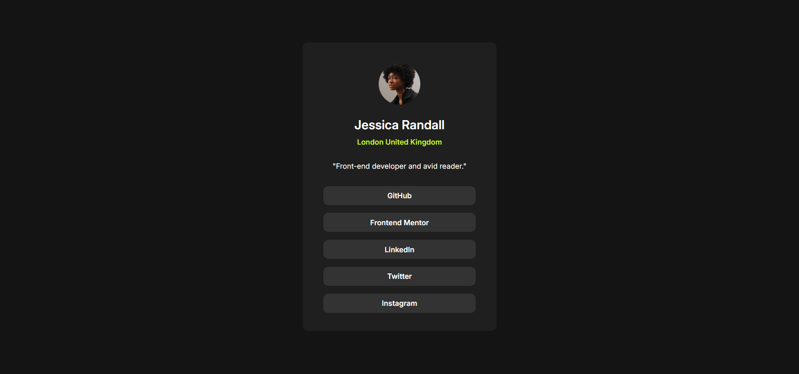

# Frontend Mentor - Social links profile solution

This is a solution to the [Social links profile challenge on Frontend Mentor](https://www.frontendmentor.io/challenges/social-links-profile-UG32l9m6dQ). Frontend Mentor challenges help you improve your coding skills by building realistic projects. 

## Table of contents

- [Overview](#overview)
  - [The challenge](#the-challenge)
  - [Screenshot](#screenshot)
  - [Links](#links)
- [My process](#my-process)
  - [Built with](#built-with)
  - [What I learned](#what-i-learned)
- [Author](#author)

## Overview

### The challenge

Users should be able to:

- See hover and focus states for all interactive elements on the page

### Screenshot

### Links

- Solution URL: [Frontend Mentor Solution URL](https://www.frontendmentor.io/solutions/social-media-preview-card-i-EdEDMqEL)
- Live Site URL: [live site URL](https://abdulrrahmann.github.io/social-links-profile/)

## My process

### Built with

- Semantic HTML5 markup
- CSS custom properties
- Mobile-first workflow

### What I learned

I create a custom social links card and make it center that can be use by anyone after replacing the content with it's own information. 

## Author

- Github - [abdulrrahmann](https://github.com/abdulrrahmann)
- Frontend Mentor - [@abdulrrahmann](https://www.frontendmentor.io/profile/abdulrrahmann)

